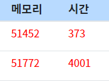

# Scanner 클래스
-> 속도가 많이 느려서 비추

# 대체방법
-> BufferReader , BufferWriter 클래스를 사용하면 시간 축소 됨

## BufferReader , BufferWriter 클래스
> 버퍼를 가지는 입출력스트림
>
> 버퍼란 데이터를 일시적으로 저장하기 위한 공간을 의미
> 
> 하나하나씩 출력하는것이 아닌 다 담아뒀다가 한꺼번에 출력하는 것
> 
> IOException을 발생시킬수 있기에 예외처리 해주어야 함
> 
> BufferWriter 를 사용할 때 flush() 메소드를 꼭 사용해야 됨
> 
> 이유는 버퍼스트림은 버퍼가 꽉 찼을때만 출력되는 특징이 있어서 데이터는 출력했지만 화면에
> 안보일 수 있기때문에 사용해야됨

# Scanner 와 BufferReader 속도차이

> Scanner : 4001
> 
> BufferReader : 373
> 
> 약 11배나 차이남..